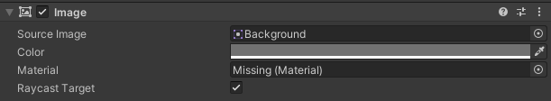
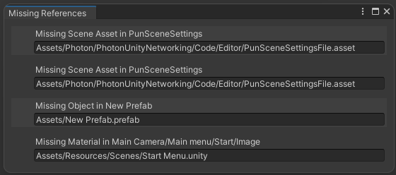

# Missing Reference Unity Tool
### This tool finds all missing references in Unity Project and displays the results in a separate window.

Инструмент находит и выводит в отдельном окне missing ссылки во всех файлах каталога Assets проекта Unity. Открывает файлы сцен и префабов во время обработки, проверяя также все дочерние объекты. Для больших проектов обработка может занять длительное время. Пример "утерянной" ссылки:

 

# Установка и запуск:
- Скопировать и вставить [MissingReferenceTool.cs](./MissingReferenceTool.cs) в каталог вашего проекта;
- Убедиться что нет не сохраненных сцен и префабов;
- Запустить инструмент через Tools/Find Missing References;


- Результат будет выведен в окне Missing References:



# Принцип работы:
Запускается цикл по всем путям каталога Assets, загружаются компоненты корневых и дочерних объектов, и все их сериализованные свойства подвергаются следующим сравнениям:
```csharp
SerializedProperty.objectReferenceValue == null && SerializedProperty.objectReferenceInstanceIDValue != 0
```
Отличие missing и null ссылок в значении Instance ID. Если оно больше нуля, но сравнение с null возвращает true, значит ссылка является "утерянной". Для реализации использован этот способ, т.к. он является самым надежным и производительным из найденных мной.

# Другие способы проверки:
1) Альтернативный способ получить значение Instance ID, но менее производительный, т.к. необходимо перебирать все свойства файла.
```csharp
SerializedProperty.FindPropertyRelative("m_FileID")
```
2) При обращении к атрибуту потенциально утерянной ссылки возникает ошибка типа MissingReferenceException, которую можно обработать через try-catch. Недостаток этого метода в том, что ошибка возникает только при работе с классом GameObject, а missing ссылки могут встречаться и в других классах.
```csharp
try
{
    _ = property.name;
}
catch (MissingReferenceException)
```
3) При этом способе считывается содержимое каждого файла в целях найти guid объекта. Отсутствие такого же идентификатора в коллекции гуидов проекта говорит об утерянности ссылки. При таком решении необходимо разбирать содержимое каждого файла, что излишне усложняет разработку.
```csharp
AssetDatabase.GUIDFromAssetPath() <> DecodeGUID(File.ReadAllLines()) // DecodeGUID - абстрактный метод расшифровки
```
